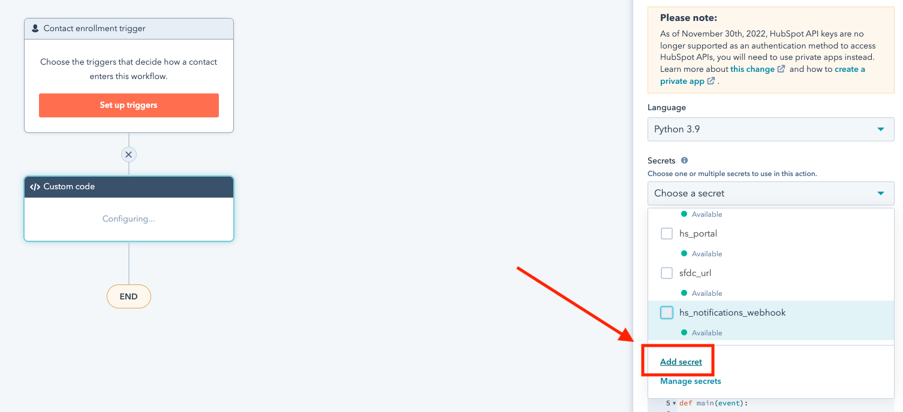

# Using Ops Hub for custom Slack notifications

This is a quick rundown on how to use HubSpot custom code actions in a workflow to create custom slack notifications using Slack's Block Kit framework. 

_HubSpot has native support for Slack, but the notifications are very limited and appear to be using Slack's legacy attachments framework._

## Create a custom Slack app

You'll need to start by creating a custom Slack app in the Slack instance where you want your notifications to end up. Slack, like HubSpot is moving aware from generic incoming webhooks (generic api endpoints). This new setup is great because it keeps each app isolated and adds a layer or security.

You can create your own app at [https://api.slack.com/apps](https://api.slack.com/apps). 

Once you've followed Slack's instructions for setting up the app you can generate an incoming webhook specifically for this app. You can do that now, and we'll use it later.

## Setting up your custom code action

The basic concept of the script I've written would work for any object in HubSpot (workflow type), but in this example and sample code it's running on a contact workflow.

### Secrets



### Property to include in code

screenies

### Code

I've chose Python because I've got a lot more experience scripting in Python than I do with JavaScript—if anyone wants to rebuild in JS, I'd love to see so I can learn.

I've tried to make this code as plug and play as possible by leveraging HubSpot _Secrets_ to set env variables—that way you won't need to edit the code except for things you need to change (i.e. proprieties, json elements in the Slack payload, etc.).

Here's the script:

```python
import os
from hubspot import HubSpot
from hubspot.crm.contacts import ApiException
import requests
import json


def main(event):


 # set env variables
 api_key = os.getenv('HAPIKEY')
 hs_portal = os.getenv('hs_portal')
 hs_notifications_channel = os.getenv('hs_notifications_webhook')
 growth_ops_testing_channel = os.getenv('growth_ops_testing_webhook')
 sfdc_url = os.getenv('sfdc_url')
 amplitude_search = os.getenv('amplitude_search')


 # set variable values to be used by slack_data payload
 email = event.get('inputFields').get('email')
 firstname = event.get('inputFields').get('firstname')
 lastname = event.get('inputFields').get('lastname')
 jobtitle = event.get('inputFields').get('jobtitle')
 owner = event.get('inputFields').get('hubspot_owner_id')
 landing_page = event.get('inputFields').get('landing_page')
 utm_source = event.get('inputFields').get('utm_source')
 utm_medium = event.get('inputFields').get('utm_medium')
 utm_campaign = event.get('inputFields').get('utm_campaign')
 utm_content = event.get('inputFields').get('utm_content')
 utm_term = event.get('inputFields').get('utm_term')
 salesforceleadid = event.get('inputFields').get('salesforceleadid')
 salesforcecontactid = event.get('inputFields').get('salesforcecontactid')
 contact_id = event.get('inputFields').get('hs_object_id')
 recent_form_page = event.get('inputFields').get('recent_form_page')
 seg_anon_id = event.get('inputFields').get('segment_anonymous_id__c')


 # coalesce sfdc contact/lead id into global id for link in slack_data payload
 sfdc_id = salesforcecontactid or salesforceleadid


 # get owner name from hubspot_owner_id (owner)
 hubapi_url = f'https://api.hubapi.com/crm/v3/owners/{owner}'

 headers = {
  'Authorization': f'Bearer {api_key}'
 }

 response = requests.get(hubapi_url, headers=headers)
 event = response.json()
 owner_fname = ''
 owner_lname = ''
 owner_email = ''

 if len(event) > 5:
  owner_fname = event['firstName']
  owner_lname = event['lastName']
  owner_email = event['email']
 else:
  pass


 # hi hs_notifications channel webhook
 webhook_url = hs_notifications_channel

 #hi growth_ops_testing channel webhook
 # webhook_url = growth_ops_testing_channel

 # slack json payload
 slack_data = {
  'text': '🎉 New Inbound Lead!',
  'blocks': [
   {
    'type': 'header',
    'text': {
     'type': 'plain_text',
     'text': '🎉 New Inbound Lead!',
    }
   },
   {
    'type': 'section',
    'fields': [
     {
      'type': 'mrkdwn',
      'text': f'*Name:*\n{firstname} {lastname}'
     },
     {
      'type': 'mrkdwn',
      'text': f'*Role:*\n{jobtitle}'
     }
    ]
   },
   {
    'type': 'section',
    'fields': [
     {
      'type': 'mrkdwn',
      'text': f'*Owner:*\n{owner_fname} {owner_lname}'
     },
     {
      'type': 'mrkdwn',
      'text': f'*Land Page:*\n{landing_page}'
     }
    ]
   },
   {
    'type': 'section',
    'fields': [
     {
      'type': 'mrkdwn',
      'text': f'*Conversion Page:*\n{recent_form_page}'
     },
     {
      'type': 'mrkdwn',
      'text': f'*UTM Source:*\n{utm_source}'
     }
    ]
   },
   {
    'type': 'section',
    'fields': [
     {
      'type': 'mrkdwn',
      'text': f'*UTM Medium:*\n{utm_medium}'
     },
     {
      'type': 'mrkdwn',
      'text': f'*UTM Campaign:*\n{utm_campaign}'
     }
    ]
   },
   {
    'type': 'section',
    'fields': [
     {
      'type': 'mrkdwn',
      'text': f'*UTM Content:*\n{utm_content}'
     },
     {
      'type': 'mrkdwn',
      'text': f'*UTM Term:*\n{utm_term}'
     }
    ]
   },
   {
    'type': 'actions',
    'elements': [
     {
      'type': 'button',
      'text': {
       'type': 'plain_text',
       'text': ':salesforce: View in SFDC',
      },
      'url': f'https://{sfdc_url}.lightning.force.com/{sfdc_id}'
     },
     {
      'type': 'button',
      'text': {
       'type': 'plain_text',
       'text': ':hubspot: View in HubSpot',
      },
      'url': f'https://app.hubspot.com/contacts/{hs_portal}/contact/{contact_id}'
     },
     {
      'type': 'button',
      'text': {
       'type': 'plain_text',
       'text': ':amplitude: Search in Amplitude',
      },
      'url': f'{amplitude_search}email%3D{email}'
     }
    ]
   }
  ]
 }

 # post to slack
 response = requests.post(
  webhook_url, data=json.dumps(slack_data),
  headers={'Content-Type': 'application/json'}
 )
 if response.status_code != 200:
  raise ValueError(
   'Request to slack returned an error %s, the response is:\n%s'
   % (response.status_code, response.text)
  )


 # hs return data for use in later workflow actions
 return {
  'outputFields': {
   'email': email,
   'full_name': firstname+' '+lastname,
   'jobtitle': jobtitle,
   'owner': owner,
   'landing_page': landing_page,
   'recent_form_page': recent_form_page,
   'utm_source': utm_source,
   'utm_medium': utm_medium,
   'utm_campaign': utm_campaign,
   'utm_content': utm_content,
   'utm_term': utm_term,
   'sfdc_id': sfdc_id,
   'contact_id': contact_id,
   'seg_anon_id': seg_anon_id
  }
 }
```
